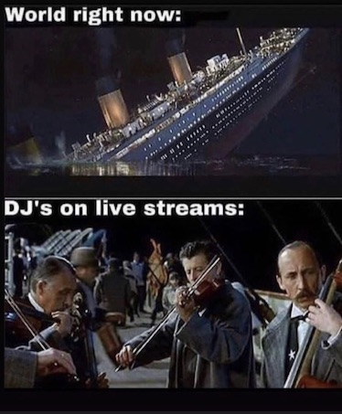

# Livestream FAQ

## Requirements

bare minimum:

- A mobile phone
- A FB, Insta, Twitch, Youtube, or other streaming platform account

next steps:

- A machine running MacOS, Windows, or Linux
- Streaming software, typically [OBS Studio](https://obsproject.com/)
- A webcam or a mobile phone that can be connected to OBS Studio for use as a camera.
  - other camera alternatives include DSLRs or Camcorders
- A microphone

## FAQ

> Can I stream using just my phone?

Yes, but there's a few disadvantages:

- You are limited to a single streaming platform (i.e. Instagram)
- It's a lot harder to interact with the audience via chat, etc
- Some services like YouTube Live do not allow live streaming from mobile unless you have 1000+ subscribers
- You have less options for processing the audio / video before sending it out to stream
  - DJs: this is important because you should really put a limiter on your mix. This will help you maximize volume.

> How Do I Record Audio into my Phone?

If you just need mic input, that's easy b/c it's already built-in.

But if you need line input from a mixer or some other audio source, it's difference for every phone. I have an iPhone XR, which can be connected to certain audio interfaces over class-compliant USB. Some Android phones allow a similar type of connection. Older iPhones have the Camera Connection Kit, which allows for a stereo mini jack input. Regardless, getting audio into the phone to stream typically requires some sort of cable or dongle.

> What is OBS Studio?

OBS Studio is an open-source streaming tool for MacOS/Linux/PC that allows you to send streams to FB Live, YouTube, Twitch, and any other service that supports the [RTMP protocol](https://en.wikipedia.org/wiki/Real-Time_Messaging_Protocol). If you want to have text overlays, visualization, share your desktop screen, etc then OBS is worth looking into.

> What's a Reasonable Example of Using OBS Studio with an iPhone?

Most webcams, even the built-in ones on iMacs and Macbooks, are garbage. Meanwhile, the camera technology on iPhones and Androids are way better. So a smart way to go is to use your smartphone as the 'camera' and send the video to OBS Studio for streaming. Depending on the phone, there are different ways to do this.

For the iPhone, I'm using [Camera for OBS Studio](https://obs.camera/). This app allows you to send video back to OBS Studio via WiFi or USB, and it works great.

> My Audio is too quiet!

Turn it up lol. J/k you should consider using OBS Studio, which lets you run your audio through VST plugins. This allows you to, for example, put a limiter on the audio sent to stream. Or put some stupid effects on it for I dunno what reason.

> Why does there have to be 10,000 streaming platforms. Can't I just stream to them all?

I found a service called [restream.io](https://www.restream.io) that lets you stream to many platforms at the same time. I tried it today (3/23), and it worked OK, although Facebook Live disconnected a ton and had buffering issues. So this remains a somewhat open question. Curious to see if anyone else has better luck w Restream...

> OBS is confusing af, I hate this.

I know. But it's free! Go on YouTube and find some tutorials.

> Now that everyone is streaming their stupid DJ sets, which platform is the best?

Right now, I think Twitch is the easiest to set up and has the best stability. Unfortunately, people are insanely lazy and don't want to click on anything that takes them off of Facebook or Instagram. I guess you just have to start all over again on Twitch and cross-post alerts, which sucks but the world is ending anyway so who cares 🗽

## Further Reading

Excellent article from Cycling 74 on live streaming a Max patch, but relevant instructions for MacOS + OBS configuration: [https://cycling74.com/articles/tips-for-streaming-your-max-patch](https://cycling74.com/articles/tips-for-streaming-your-max-patch)
